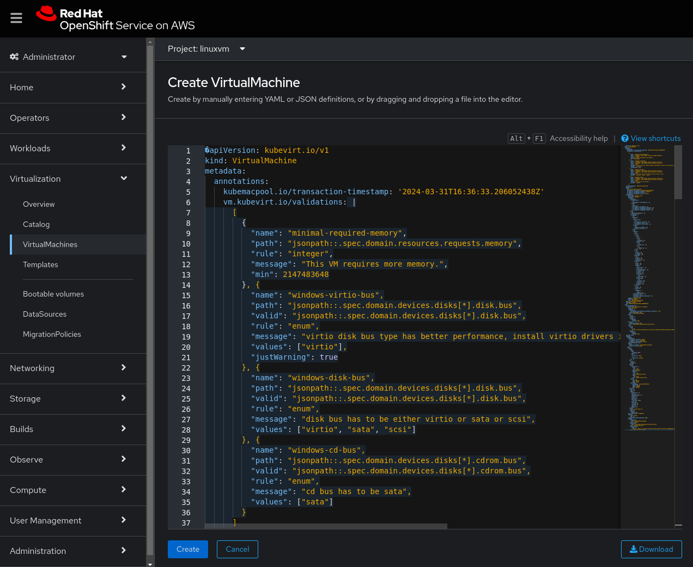

This is a quick workshop format demonstration of Red Hat Virtualization on ROSA.
Red Hat OpenShift Virtualization is based on the Kubevirt OpenSource project delivered via ROSA. 
ROSA is the joint AWS and Red Hat managed service based on OpenShift delivered as a console service in AWS. 
Virtualization on ROSA gives you the ability to host Virtual Machines of Linux and Windows with Containers on ROSA. 
By Andrew Grimes with videos from Alan Cowles, Jim Garrett and Mayur Shetty 

Basic ROSA Overview Video https://www.youtube.com/watch?v=6W-xDavWgYg&t=4s

Joint AWS and Red Hat Blog on Virtualization on ROSA for the value prop
https://www.redhat.com/en/blog/managing-virtual-machines-and-containers-as-code-with-openshift-virtualization-on-red-hat-openshift-service-on-aws

This Workshop assumes you are using a ROSA instance created out of the Red Hat Demonstration System (RHPDS) for a Demo or POC. We use EBS local storage so live migration is not supported with EBS Storage. We support other storage services and will support more partner services in the future if live migration, hybrid use cases or data protection integraiton is required. These procedures are optimized for RHPDS demo system but the procedures should work in any account context if needed. Please note we require "bare metal" workers for ROSA to work and those are more expensive than regular EC2 Instances so we suggest setting cost alerts on your account and shutting down the workshop when not in use. 

Virtualization on ROSA Catalog. 

    
  <em> 
  </em>

Below are te instructions and Links for a quick Virtualization on ROSA Install and Setup for a Basic Demo of the serve. 
This uses local EBS storage so live migration is not available. We recommend deleting your lab when not in use as the VM’s can be expensive. 
The AWS FSXN service with NFS as well as Pure Portworx are also supported options. ODF is planned for a future release for storage. 

The below steps "assumes" you have RHPDs access to the ROSA Open Lab setup to execute the following steps again. This will create a Container Image Classifications Container App with Fedora, RHEL and Windows Virtual machines created from ISO images.  

#1 Use this link to create a Basic ROSA Cluster via RHPDS or installed in single AZ (2 workers) 
https://demo.redhat.com/catalog?item=babylon-catalog-prod/sandboxes-gpte.rosa.prod&utm_source=webapp&utm_medium=share-link

Lab Used for this workshop in RHPDS, avaialble to AWS and Partners, check with your account team for a Level Up Demo. 

    
  <em> 
  </em>

#2 Using your Red Hat ID, collect your console token for your Red Hat ID, and Install with your personal Token so you can use the Hybrid Cloud Console Later to "add" workers to your cluster via the Red Hat system. 

#3 Verify cluster install is complete by logging onto the console and checking status. CLI is not required but we do recommend using VS Code with the OpenShift plugin to update configuration files. 

#4 Login to the console and then use the link included to get to “your” hybrid cloud console via token access, then add supported metal workers to the machine pool. Only metal workers are supported for VM creation on ROSA. 

#5 Use the hybrid cloud console to get to your cluster directly and click machine pool and then add, select metal worker and add 2 with auto scaling setup to 3 M5.metal is the ideal case. 

M5zn.metal is a cheaper option (48vCPU vs 96 vCPU) and half the cost on AWS side
The full list is here https://aws.amazon.com/marketplace/pp/prodview-tnyp2h3acabm6

Using the Hybrid Cloud Console use add machine pool to add a supported Bare Metal Worker. 

    
  <em> 
  </em>

#6 Check your Console for worker building status it will show “creating” 0/2 until complete. Takes about 45 min. 
This is visible under the Admin Main conosole in Compute, Machine Set. 

Use Compute, Machine Set to check on worker add status. This will take approx 30-45min. 

    
  <em> 
  </em>

#7 In parallel to the bare metal machine pool, Install OpenShift Virtualization in the Operator Hub, install “OpenShift Virtualization" and take defaults. Install to all accounts. 

Operation Install Method. 

    
  <em> 
  </em>

#8 Create a Hyperconverged instance as well with defaults in the CNV namespace. Once complete this will trigger a reload of the console to make the "Virtualization" menu visible. 

Add HyperConverged Space to the Operator to deploy VM's. 

    
  <em> 
  </em>

#9 Create a linuxvm project under developer profile to deploy your applications into so they are isolated from other workloads but they can be grouped to "share" the application namespace. 

#10 Optional: add Container workload to a project if you want a mixed environment demo to show the VM's and containers interacting. 
Deploy backend: https://github.com/emcon33/inference-rosa-workshop
Deploy frontend:  https://github.com/emcon33/inference-rosa-frontend

#10 When OpenShift Virtualization Operator is installed, the console will request an update: Refresh to see virt tools show up in the side menu. Verify they are visible and avaialable. 

This banner will appear once the Operator and Hyperconverged space is installed. 

    
  <em> 
  </em>

#11 Verify your Workers are completed import and installed under Compute, Machine Set, once it is 2/2 you can create a VM once they are added and online. 

#12 Create a RHEL or Fedora VM using “defaults” in the linuxvm project, save the password from the optional tab to login later. 
By defaul the RHEL, Fedora and CentOS ISO's are included for installation. Windows requires you upload an ISO or use a URL to link to the ISO. 
The default user name for RHEL and Fedora are  
Fedora Default User: "fedora" & RHEL Default User: "cloud_user"

Console Catalog of Virtualization Services. 

    
  <em> 
  </em>

Default Fedora Creation Panel.  

    
  <em> 
  </em>

Fedora Optional Install panel with install password. 

    
  <em> 
  </em>

#13 VM “provisioning” will take about 10min and your up, access via the console tab and use the logon and password from above. 

#14 You are now up and running with a VM, add it to the app space with containers to show a mixed environment. Extract your YAML and use that in a pipeline/gitops etc. 

Fedora Install look with console. 

    
  <em> 
  </em>

#15 You can associate the VM with your application grouping and you now have a hybrid application of containers and VM's 

Hybrid App of VM's and Containers. 

    
  <em> 
  </em>

#16 For a Windows image, you need to upload an ISO or obtain an iso URL and install from image using defaults. 
Obtain Windows ISO here https://www.microsoft.com/en-us/software-download/windows10ISO
Download, or select the options until you start the download and use that URL if you want a direct to ROSA
We are not providing a Windows lic. 

Steps to build windows:  

Select Create VVM from Template/catalog and select Windows 10 and options

Select boot from CD

Put in the URL you obtained below from the Windows ISO website 
this is a 5GB file so upload will take some time, the URL method took about 5min

Windows 10 Setup will look like this. 

    
  <em> 
  </em>

Windows on ROSA deployed with console access. 

    
  <em> 
  </em>

You now have a Windows Live Image, you can step through the install steps. If you performed the prior setup you now have a Hybrid App with Containeres, RHEL, Fedora and Windows 10 images all available. 

Hybrid App with Linux, Windows and Containers integrated. 

    
  <em> 
  </em>

Here is a Direct Link to Windows 10 64bit English ISO: 
https://software.download.prss.microsoft.com/dbazure/Win10_22H2_English_x64v1.iso?t=1182d063-b4cc-4e05-b23b-b0e360f24bef&P1=1711927623&P2=601&P3=2&P4=STgkkfcF8I2W9rpuFC0kO9LrUryOUY8rzB7LPCAya1YuUA56eKW205X624OD6uE%2fkSniKcF5esmiKlzkcEOCPaEz%2b4pEIq%2fONKP%2fzXS7%2bn7e8g%2bXgQmDsecmzWf29%2b%2b0aJNd2fDey2IOxG8o1LrKczfp8P5YlhiODB20CsoUuzkuMzVJNHcy3J7UDzR%2bmSaAM2wacQ11%2f4bD89%2fAnSMsm8yj5xZv3PrvmBrg%2fkPE1LzvSeQbbkLgc5KaOkCilnrbY%2b07UwRl1L3nN%2fMay9fhACdquTOrnlDWNMGkzAuxF9t2Yo1XV7%2bt596dISKNOQZ4xO2CU%2bvXg9Ppht3uWkcuaw%3d%3d

#17 Treating your VM's as code buy using YAML to deploy images and create from YAML file. 
Sample Windows VM YAML (needs to be tested, may need to update the URL link to work) 
Windows YAML https://github.com/emcon33/Virtualization-on-ROSA/Windows10_create.yaml
Fedora YAML https://github.com/emcon33/Virtualization-on-ROSA/blob/fedora.yaml

Create a windows image by YAML file, you can use "create vm, YAML template and cut and paste the above into the window and then create. 
You an generate the YAML file by doing a grpahical create step and then save the YAML to a file. 

    
  <em> 
  </em>

#18 WIP Setup ArgoCD and use it to manage the YAML lifecycle of your VM and container deployments. 
ArgoCD Setup instructions 
Windows Images via ArgoCD 
https://github.com/OOsemka/gitops-demo/

Windows VM Pipelines
https://github.com/kubevirt/kubevirt-tekton-tasks/tree/main/release/pipelines/windows-efi-installer

https://github.com/tosin2013/openshift-virt-tekton-ref
https://github.com/tosin2013/openshift-virt-tekton-ref/tree/main/docs

#19 WIP Import a VM into Virtualization on ROSA. 
Requires a VMware or VMC environment to pull images out of. 
Virtualizaiton on ROSA vid 3 import VM https://www.youtube.com/watch?v=5zossjikJm8&t=1s

Resource Links: 
Video setup of much of the above if you want a video source. Thanks Alan Cowles for recording these. 
Virtualization on ROSA Supporting Videos: 
You can also follow these videos by Alan Cowles 
Virtualization on ROSA vid 1 Setup New https://www.youtube.com/watch?v=wBtY3tvjtIU
Virtualization on ROSA vid 2 Create VM  https://www.youtube.com/watch?v=7EpmmUIhQ7c&t=52s
Virtualizaiton on ROSA vid 3 import VM https://www.youtube.com/watch?v=5zossjikJm8&t=1s

More Links
Virtualization on ROSA Learning Path to get trained on Virtualization on ROSA.
https://cloud.redhat.com/learn/how-manage-virtual-machines-using-red-hat-openshift-virtualization-red-hat-openshift-service

Storage Partners required for OpenShift Virtualization Live Motion on ROSA (thanks Mayur Shetty)
ROSA with FSXN Storage Blog Jan 10, 2024 (external)
https://www.redhat.com/en/blog/fully-managed-shared-file-storage-for-rosa

Pure Portworx with ROSA Virtualization 
Light Boards to post: (thanks Mayur Shetty)
https://www.youtube.com/watch?v=V2kdVwKCId0
https://www.youtube.com/watch?v=YIEQCZxzoU4

