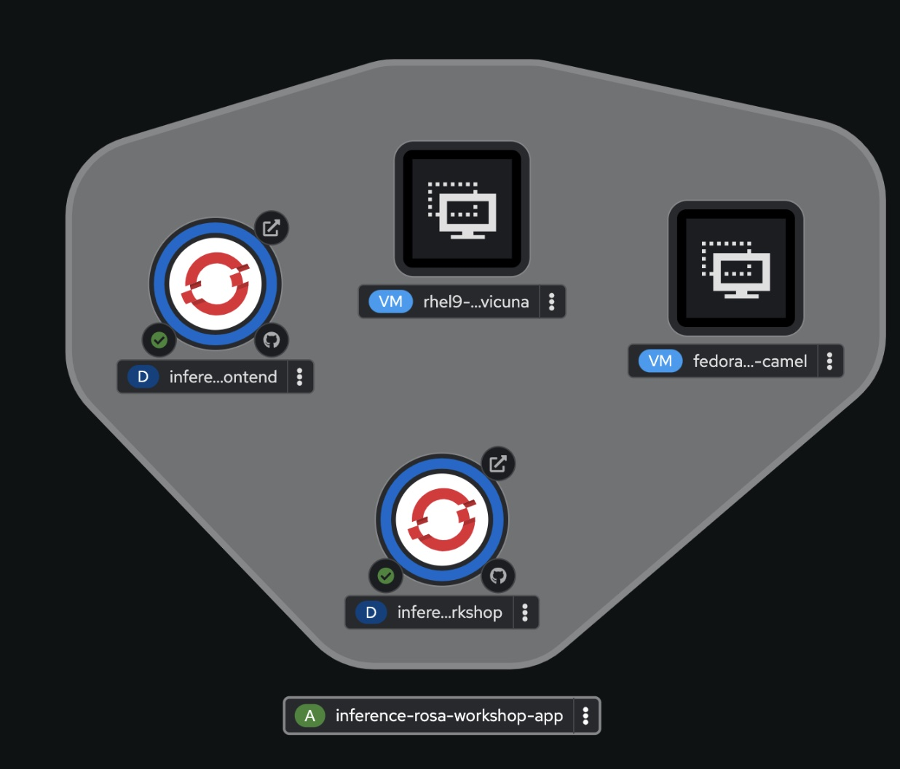

This is a quick workshop format demonstration of Red Hat Virtualization on ROSA
Red Hat OpenShift Virtualization is based on the Kubevirt OpenSource project delivered via HCP
ROSA is the managed service based on OpenShift delivered as a Managed Service in AWS
Virtualization on ROSA is the ability to host Virtual Machines inside of Containers on ROSA

Joint AWS and Red Hat Blog on Virtualization on ROSA
https://www.redhat.com/en/blog/managing-virtual-machines-and-containers-as-code-with-openshift-virtualization-on-red-hat-openshift-service-on-aws

This Workshop assumes you are using a ROSA instance created out of the Red Hat Demonstration System for a POC. 
Many of the procedures will work in your account context if needed. Please note we require "bare metal" workers for ROSA to work and those are more expensive than regular EC2 Instances so we suggest setting cost alerts on your account and shutting down the workshop when not in use. 

    
  <em> 
  </em>

Quick Virtualization on ROSA Install and Setup for a Basic Demo
This uses local EBS storage so live migration is disabled. Delete your lab when not in use as the VM’s can be expensive. 

#1 Use a Basic ROSA Cluster via RHPDS or installed in single AZ (2 workers) 
https://demo.redhat.com/catalog?item=babylon-catalog-prod/sandboxes-gpte.rosa.prod&utm_source=webapp&utm_medium=share-link

Lab Used for this workshop in RHPDS 

    
  <em> 
  </em>

#2 Install with your personal Token for your Red Hat ID or personal ID so you can use the Hybrid Cloud Console Later to "add" workers to your cluster via the Red Hat system. 

#3 Verify cluster install is complete 

#4 Login to the console and then use the link to get to “your” hybrid cloud console, then add to machine pool.

#5 Use the hybrid cloud console to get to your cluster directly and click machine pool and then add, select metal worker and add 2 with auto scaling setup to 3
M5.metal is the ideal case. 
M5zn.metal is a cheaper option (48vCPU vs 96 vCPU) and half the cost on AWS side
https://aws.amazon.com/marketplace/pp/prodview-tnyp2h3acabm6

    
  <em> 
  </em>

#6  Check your Console for worker building status it will show “creating”  0/2 until complete. Takes about 45 min. 

    
  <em> 
  </em>

#7 In parallel,  In the Operator Hub, install “OpenShift Virtualization and take defaults”

    
  <em> 
  </em>

#8 Create a Hyperconverged instance as well with defaults

    
  <em> 
  </em>

#9 Create a linuxvm project under developer

#10 Once your machine pool is showing 2/2 you can create a VM

#11 Create a RHEL or Fedora VM as “defaults” in the linuxvm project, save the password to login later. 

#12 VM “provisioning” will take about 10min and your up

#13 You are now up and running with a VM, add it to a project with containers to show a mixed environment. Extract your YAML and use that in a pipeline/gitops etc. 

    
  <em> 
  </em>

You can also follow these videos by Alan Cowles
Virt on ROSA vid 1 Setup New
Virt on ROSA vid 2 Create VM 

Mix with other workloads and do a hybrid app: 
https://github.com/emcon33/inference-rosa-workshop

WIP
Get a Windows iso and do a Windows deployment 
https://www.microsoft.com/en-us/software-download/windows10ISO

Hi Andy, I see you were looking for a Win iso image
This is what we have on cnv-qe server:
http://cnv-qe-server.rhos-psi.cnv-qe.rhood.us/files/cnv-tests/windows-images/install_iso/win2022/
this one is used at least once in our tests: Windows_Server_2022_x64FRE_en-us.iso

Deploy from YAML <WIP>
https://drive.google.com/file/d/1Em6ZtRtpHR4ed4XJkcq9aNgAxRrx_lrP/view?usp=sharing

Windows VM Pipelines
https://github.com/kubevirt/kubevirt-tekton-tasks/tree/main/release/pipelines/windows-efi-installer

https://github.com/tosin2013/openshift-virt-tekton-ref
https://github.com/tosin2013/openshift-virt-tekton-ref/tree/main/docs

GitOps via YAML
https://medium.com/@tcij1013/deploying-openshift-virtualization-on-red-hat-openshift-on-aws-rosa-847e2440fce4

https://github.com/OOsemka/gitops-demo/tree/main

If you wish to test with “Live Motion” and external storage options: 
Test with FSXN Storage in RHPDS System:Virt ROSA with FSXN Lab
Test with Pure Portworx on RHPDS System Virt OCP/ROSA w Pure Portworx Lab   
ODF is not officially supported now but can be. 

More Links
